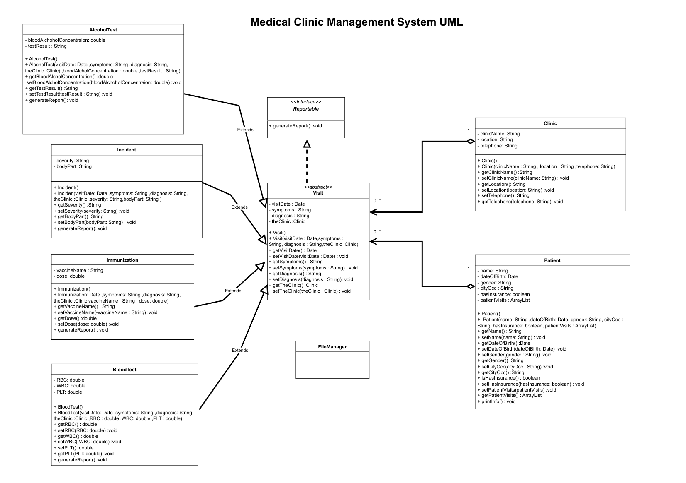

# Medical Clinic Management System

## Project Overview

The Medical Clinic Management System is a Java-based Object-Oriented Programming project designed to record, manage, and analyze information about patients attending medical clinics.

The project is developed in two phases:

- **Phase I:** Implementation of the core system using Java OOP concepts and console-based interaction.
- **Phase II:** Extension of Phase I by adding a JavaFX graphical user interface and file handling for data persistence.

A Patient can make multiple Visits to Clinics. Different types of medical visits are supported, including Blood Tests, Alcohol Tests, Incidents, and Immunizations.

---

# Project Phases

## Phase I — Core OOP Implementation

### Main Features

- Add and view patient information.
- Create different types of medical visits.
- Associate patients with their visits.
- Associate visits with clinics.
- Print patient and visit information to the console.
- Search for a patient and display all associated visit information.
- Use a console-based menu to interact with the system.

### Visit Types

The system supports four types of visits:

1. Blood Test
2. Alcohol Test
3. Incident
4. Immunization

### OOP Concepts

#### Encapsulation

Private fields with getters and setters are used throughout the classes to control access to object data.

#### Abstraction

`Visit` is an abstract class that defines common attributes and behavior shared by different types of medical visits.

#### Inheritance

The following classes inherit from `Visit`:

- `BloodTest`
- `AlcoholTest`
- `Incident`
- `Immunization`

#### Interface

The `Reportable` interface is implemented by the visit-related classes. It provides the `generateReport()` method for printing visit information.

#### Association

A `Patient` can have multiple `Visit` objects, while each `Visit` is associated with a `Clinic`. A Clinic can have multiple Visits.

#### ArrayLists

ArrayLists are used to store collections of patients, visits, and related data.

### Phase I Console Menu

The console application provides the following options:

1. New Blood Test visit
2. New Alcohol Test visit
3. New Incident visit
4. New Immunization visit
5. Print Patient visit information
6. Exit

When creating a visit, the user enters the required Patient, Visit, and Clinic information.

When selecting the patient information option, the system searches for the specified patient and displays the patient's information and associated visits.

---

# Phase II — JavaFX UI and File Handling

Phase II continues the implementation from Phase I and introduces a graphical user interface using JavaFX and file handling for data persistence.

### Classes Imported from Phase I

The following classes from Phase I are used in Phase II:

- `Patient`
- `Visit`
- `Incident`
- `Clinic`

### FileManager

A new `FileManager` class is introduced to handle saving data to a text file.

The class provides the following method:

`savePatientVisit(Patient)`

This method receives a `Patient` object associated with its `Incident` and `Clinic` objects and saves the related information to a text file.

New records are appended to the file so that previously saved data is not overwritten.

### JavaFX User Interface

A JavaFX form is created to allow users to enter information about:

- Patient
- Incident
- Clinic

The form uses different JavaFX controls, including:

- Labels
- Text Fields
- Combo Boxes
- Radio Buttons
- Check Boxes
- Buttons

### Form Features

The JavaFX form provides the following functionality:

- Enter Patient information.
- Enter Incident information.
- Enter Clinic information.
- Validate entered data.
- Display alerts when required information is missing or incorrect.
- Save entered information to a text file.
- Clear all form fields.
- Save one Patient, Clinic, and Incident record each time the user saves the form.

### File Handling

All entered data is stored in one text file.

The `FileManager` class is responsible for appending new records to the file. A delimiter is used to separate the different fields when storing the information.

### Exception Handling

Exception-handling techniques are applied to handle possible errors during data entry and file operations.

### Object-Oriented Design

Phase II continues applying the OOP principles introduced in Phase I. The `FileManager` class separates file-saving responsibilities from the user interface and the existing domain classes.

---

# Class Overview

### Patient

Stores information about a patient, such as:

- Name
- Date of Birth
- Gender
- City
- Occupation
- Insurance information

### Visit

An abstract class representing a medical visit and containing common visit information such as:

- Visit Date
- Symptoms
- Diagnosis

### BloodTest

Extends `Visit` and stores blood test information such as:

- RBC
- WBC
- PLT

### AlcoholTest

Extends `Visit` and stores:

- Blood Alcohol Concentration
- Test Result

### Incident

Extends `Visit` and stores:

- Severity
- Body Part
- Other incident-related information

### Immunization

Extends `Visit` and stores:

- Vaccine Name
- Dose

### Clinic

Stores clinic information such as:

- Clinic Name
- Location
- Telephone

### Reportable

An interface containing:

`generateReport()`

The method is used to print visit and related class information to the console.

### FileManager

Responsible for saving data to a text file in Phase II.

---

# Technologies Used

- Java
- JavaFX
- Object-Oriented Programming
- ArrayList
- File Handling
- Exception Handling
- UML Class Diagrams

---

# Phase I UML Diagram

The Phase I UML class diagram represents the relationships between the main classes, the `Visit` inheritance hierarchy, the `Reportable` interface, and the `FileManager` class.

---

# Phase II Improvements

Phase II extends the functionality of Phase I by introducing:

- Graphical user interface using JavaFX.
- JavaFX form controls for data entry.
- Input validation.
- Alert messages for invalid or missing data.
- Clear form functionality.
- Text-file data persistence.
- Appending new records to the file.
- `FileManager` class for file operations.
- Exception handling for possible errors.

---
# UML Class Diagram

The UML class diagram for the Medical Clinic Management System:

Click the diagram to view the full PDF
